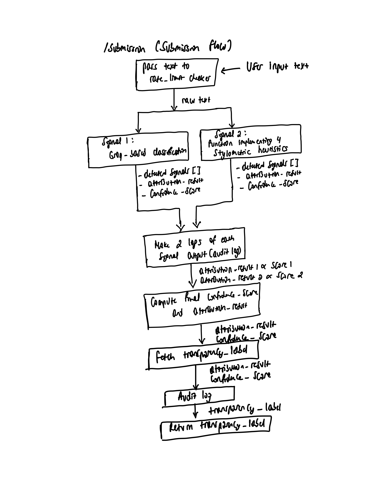
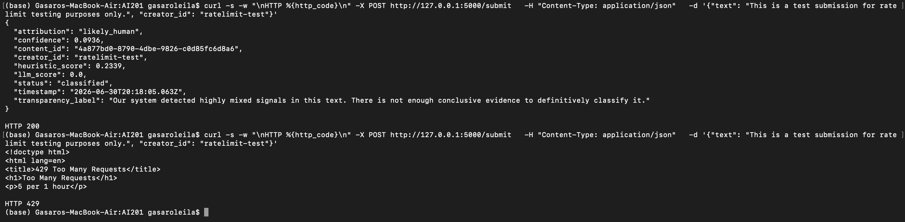

# ai201-project4-provenance-guard

Provenance Guard: a backend system that any creative sharing platform could plug into to classify submitted content as either AI-generated or human.

## Architecture Overview

This project ended up having two major architecture flows with one being depende on the other, both of them are:

### The submission flow

* Rate Limiter: The diagram show how text input of a user is first passed through a rate limiter that checks if the length of text is less than 500 and that the user has less than 5 requests/hour(reasoning will be explained later).
* Normal text verification such as length of text, etc happens here
* Signals: If within limit, the text is passed to two classification signals that each return an attribution(classification) strictly 'likely_human' or 'likely_AI'('uncertain' is not returned at this point) and a confidence score.
* Ideally logging was initially planned to happen next to save for any system issues that might occur in between, but instead the combined attribution and confidence score is calcuated.
* These two combined attributes are used to map to a transparency_label.
* Now the audit log is made combining scores from both signals and the final combined attribution and score with content_id, creator_id and timestamp.
* Finally the transparency label and a response 200 ok is returned to the user.

### The appeal flow

* The system first verifies if the input content_id exists in the audit_log file. If not it exits at this point with a 404 error. If the two required fields are not included it return 400 error.
* The right content is fetched and its status is update to 'under_review'.
* Finally a log is made to audit_log file
* A 200 response is returned.

## Detection signals

Two signals where chosen: groq_llm and Stylometric heuristics primarily because the weakness of one is complemented by the other's strenght and because these two were minimal but could still do the classification task.

### LLM Signal

It was chosen because it strong in being able to view text input holistically particularly analyzing the overall meaning and using that to classify it. It however has a small risk of being non-determnistic with could have been solved with structured testing. The thing it can do well is differentiate formal from casual, but human text can also be formal and it would almost always say that it's AI.

* Output: Groq llm just return an attribution, either 'likely_human' or 'likely_AI' and an attribution that are fed to the scoring logic.
* Cases: Sometimes it returned 'unknown' on very confusing text such as "This is a test submission..." which resulted in programmatically having to default to 'likely_human' but with a confidence score of 0(basically guesswork).

### Stylometric heuristics

This complemented LLM signal in that it's structured and captures subtle text details such as sentence length variance and punctuation marker(which were the most important heuristics under this by the way) that are hard for AI-generation to mimic and also this heuristic's confidence can be taken as being actually more truthful than the first signal. It's however harsh on human text that uses consistent sentence structure as though it always expects a lot of creativity.

* Output: Each heuristic calculates how variant the text is and a weighted sum of each of the 3 scores(called the overall_variance_score) is then taken and calibrated on how far off it is from a fixed midpoint of uncertainity. If it is far from this point, then the confidence score is high otherwise it's low. This calcualated confidence is not a classification between human or AI, it is simply the certainity that the heuristics are conveying.

## Confidence scoring

To come up with the combine confidence score and attribution, 3 states were identified as being that the two signals agree-a weighted sum of the two signals is taken, that they disagree but each signal's confidence is high enough-this is where the combined score should be uncertain, and finally that they disagress but one is higly confident than the other-this is where the score of the more confident is used.

If the two signals agree, a weighted sum of the llm_score and the heuristics_score is taken as
0.6 * llm_score + 0.4 * heuristics_score
The reason why the llm has a higher weight is because it is more holistic and reflects the reality more than the heuristics. In reality, most writers tend to be formal except the very creative ones, but the assumption was that this project was to be used on a platform that accepts all sorts of writers.

This approach was chosen because it covers all possibility from two signals and it's not biased toward one signal but instead leverages the strengths of both signals.

Two examples that higly disagreed:

- "The bridge! A marvel of human ingenuity — or is it? Consider: steel, concrete, ambition, dreams... all suspended above rushing water. Furthermore, one must acknowledge the profound symbolism inherent in such structures. Moreover, bridges connect not merely physical spaces, but metaphorical ones. It is crucial to note that every civilization has built bridges. In conclusion, they represent humanity's eternal desire to overcome obstacles.""

Output:

{
    "attribution": "likely_human",
    "confidence": 0.9954,
    "content_id": "74d71ffd-a9bb-449d-954a-2e6a57dc5b9d",
    "creator_id": "test-user-3",
    "heuristic_score": 0.9954,
    "llm_score": 0.63,
    "status": "classified",
    "timestamp": "2026-06-30T21:17:16.777Z",
    "transparency_label": "Our system is highly confident this content was written by a human creator. No significant patterns of AI generation were detected."
}

On this one, there's a lot of punctuations and sentence variance so signal 2 says it's human but the llm sees the Furthermore, moreover formal structure and says AI.

- I woke up late. I made coffee. I sat by the window. I watched the rain. I thought about her. I didn't eat lunch. I went back to bed. I couldn't sleep. I stared at the ceiling. I gave up trying.

Output:

{
    "attribution": "uncertain",
    "confidence": 0.5,
    "content_id": "3bcf59a5-6568-4e50-b48f-6604e453f504",
    "creator_id": "test-user-4",
    "heuristic_score": 0.5071,
    "llm_score": 0.8,
    "status": "classified",
    "timestamp": "2026-06-30T21:19:42.495Z",
    "transparency_label": "Our system detected highly mixed signals in this text. There is not enough conclusive evidence to definitively classify it."
}

No structural variance but the wording sounds human so llm score is confident that it is human but heuristic is maybe a bit skeptical.

NOTE: The way I calculated confidence score is not through a 0-1 sclaed where 0 means AI and 1 means human-generated. The confidence score is actually how sure each signal is of the classification it made, it answere the question, "how sure are you that it is human or AI-generated?" It might be different from the conventional way of thinking about it, so it's important to understand this.

## Transparency label

From the combined score, the transparency_label is a mapping of fixed confidence score ranges as follows:

| attribution         | confidence score | transparency_label response                                                                                                                                                   |
| ------------------- | ---------------- | ----------------------------------------------------------------------------------------------------------------------------------------------------------------------------- |
| "likely_ai"         | >= 0.75          | Our system has identified strong, highly consistent patterns of AI generation in this text.If this is an error, the creator can file an appeal via their dashboard.           |
| "likely_ai"         | 0.65 - 0.75      | Our system has detected moderate patterns commonly associated with AI generation tools.If you believe this classification is incorrect, you may submit a quick review appeal. |
| "likely_human"      | >= 0.75          | Our system is highly confident this content was written by a human creator. No significant patterns of AI generation were detected.                                           |
| "likely_human"      | 0.65 - 0.75      | Our system is fairly confident this was written by a person. While some parts are uncertain, the overall style looks like natural human writing.                              |
| "uncertain" DEFAULT | <0.65            | Our system detected highly mixed signals in this text. There is not enough conclusive evidence to definitively classify it.                                                   |

---

## Rate limiting

As explained before flask-limiter is used to limit a user(using the creator_id and not the mac_address) to 5 platform requests in an hour. On average, whether a writer is reading text and wants to verify it or writing their own text and want to verify it, they can't go over 5 texts an hour. Below is a screenshot they get if they exceed 5 requests.

## Know Limitations

- The system doesn't haMve a sweet spot for the weights when the two signals agree and if they disagree by a large difference in confidence score leaning toward only one signal might not be optimal.

This allows for texts such as the one above with a formal structure that might be human-generated to be flagged as uncertain or leaning towards ai-generated.

## Spec reflection

The spect did help a lot with structure and I based off of it to brainstorm the project.

## AI usage section (used Claude)

- request: Using the specs definined in the Multi-signal detection pipeline specifically the Stylometric heuristics point implement the second signal function and Pay attention to the details and take time to think about it surface any questions don't hide them.

questions/assumptions Claude asked:

Q1: Reference set approach — 13 common marks, score = unique used / 13
Q2: Raw TTR, no length correction
Q3: Simple regex split, abbreviations can cause phantom sentences — acceptable for prose
Q4: Single-sentence input returns 0.5 (neutral) for the SLV heuristic

What I corrected:
Answers

Q1 was answered in planning.md under Punctuation Marker(added the punctuation reference set in planning.md)
Q2 implement it raw
Q3 the text is more like a creative writing so these words are assumed to be few
Q4. yeah return neutral

- request: Now implement the combined scoring logic using the Combined Confidence + Attribution Scoring section ay attention to the details and take time to think about it surface any questions don't hide them. For debugging, print each signal's score and attribution along side the combined ones to verify what might be misbehaving

questions/assumptions Claude asked:
Q1: What threshold separates "far opposite ends" from "close"?
Q2: What if both scores are high but disagree?
Q3: "uncertain" as an attribution value

What I corrected:

Q1: I updated the section of the read me go read and implement that
Q2: yeah in that case it is uncertain.
Q3: uncertain is its own attribution, it's just that I haven't fully update the transparency_label section.