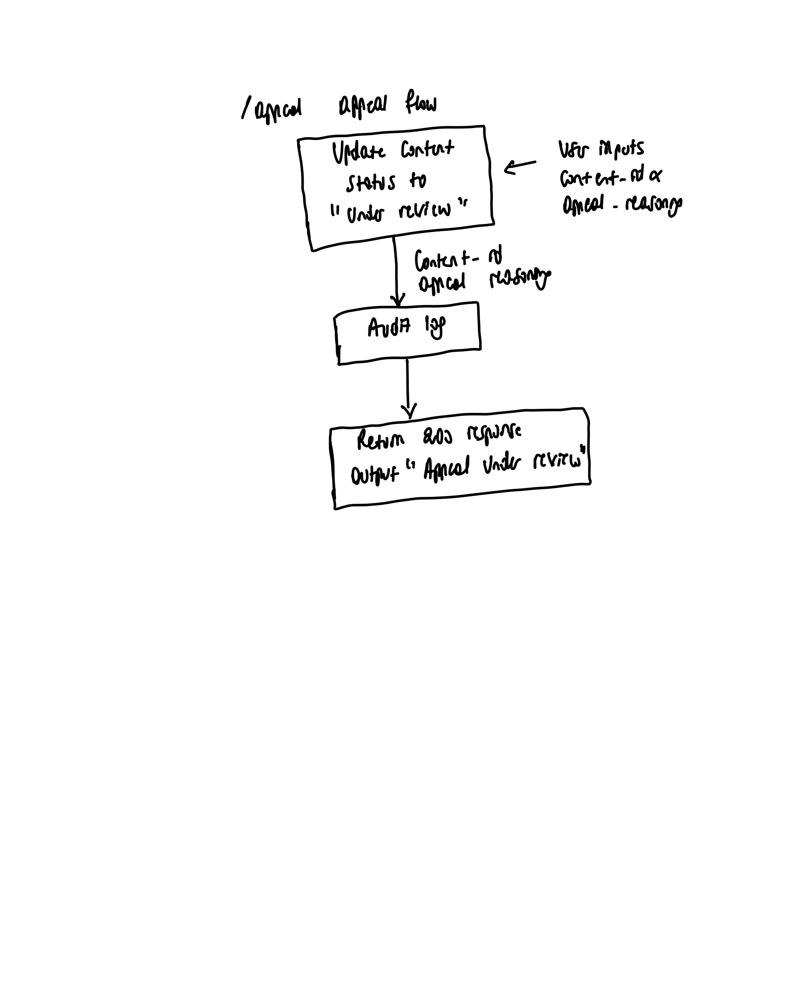

# Provenance Guard

A backend system that classifies user input text as either AI or human generated, allows users to appeal the initial classification and logs outpus.

# Shared Definitions

**attribution**: A binary classification of either "likely_ai" or "likely_human" assigned to the input text.
**confidence score**: A score between 0-1 that shows how confident the signal detection is on the attribution it gave user text.
**transparency_label**: A non-technical user message explaining the system's text classification. It varies based on the confidence score it is explained later.

# Endpoints

## 1. /submission

A POST endpoint on which users submit their text to be classified.

**Input**: String of content to be classified
**Ouput**: String explaining the text classification (this is called the transparency_label)

### Components

#### 1. Rate Limit Checker

Validates if user has not passed 5 API requests per hour and that each request has less than 500 words.

#### 2. Multi-signal detection pipeline

In this pipeline the first thing is to analyze the text semantics using Groq LLM(signal 1) then the sentence structure is analyzed using Stylometric heuristic(signal 2).

The two detection signals:

- **LLM-based classification (Groq)**: Captures the overall text coherence and assesses its overall meaning. For humans, there are no random words present in their text, every word or sentence adds to the overall meaning making sense. For AI, you can have some parts conveying something meaningful, but some words are not where they’re supposed to be or the text is not coherent from paragraph to paragraph.

Input: System prompt + user raw text
Output: An attribution and a confidence score
Process:  Return an attribution and a confidence score of how sure you're of the attribution you made. Example 0-1, 0=pure guesswork and 1=absolute certainty.

Blind spots: some human text are written in a very creative way and words are used in unusual ways and it might flag it as AI.
Long text might be hard to deduce the overall meaning or cohesiveness and might be flagged as AI.

- **Stylometric heuristics**: detects text structure without worrying about meaning. We'll use 3 heuristics:

* Type-Token Ratio (TTR): Measures lexical richness by dividing the number of unique words (types) by the total words (tokens). Human generated writing typically have higher TTR while AI usually has less TTR
* Sentence Length variance: Humans write sentences of varying lengths while AI tends to be consistent with sentence length. percentage of how many different sentence lengths there are.
* Punctuation Marker: Just like sentence lengths, human punctuation varies and is highly expressive, while AI punctuation is strictly grammatical, safe, and highly structured. This is just a percentage of how many different punctuations are used.

  The punctuation marker is a score of these two dimension with the total score calculated as a 50/50 between these two

  1. Punctuation Richness :using this set count the number of punctuations used over the total set. Ex 8/12
     punctuation_set = ['.', ',', '?', '!', ';', ':', '—', '...', '""', '()', '/', '*']
  2. Structural Entropy: Calculates the standard deviation of character distances between punctuation marks. ex: an AI-generated text can have punctuation after every 15 words while human-generated is more volatile.

    Final punctuation marker variance = 0.5*punctuation richness + 0.5 * structural entropy.

In general, AI text tends to be more uniform; human writing is more variable.

Input: user raw text
Output: An attribution and a confidence score.
Process: Each heuristic calculates a variance index based on the characteristic its measuring(0%- It is completely AI and 100%- It is completely human)
The final variance score is calculated as a weighted sum of the percentages from the three heuristics as
overall_variance_score = 0.4*sentence length variance % + 0.35*punctuation marker % + 0.25*TTR %

Based on this overall_variance_score the confidence score and attribution are determined in this range
Here is a brief mathematical summary of the calculation pipeline:

* Variables & Constants
* **$V$**: The input `overall_variance_score` (scaled $0.0$ to $1.0$).
* **Midpoint ($M$)** = $0.49625$ (the boundary line between Human and AI).
* **Max Distance** = $0.23875$ (the distance from the midpoint to either baseline).
* The Core Equations
* **attribution:**
  If V >= 0.49625 -> 'likely_human'
  If V < 0.49625 -> 'likely_AI
* **Confidence Score (C):**

C = min(1.0, ((|V - 0.49625|)/0.23875))

Blind spots: Deciding which heuristics are better than others incase of a tie might be biased.

For each signal,
**Input**: raw input text string
**Output**: Each signal detection returns a 1-3 detected signals, an attribution, and a confidence_score.

#### 3. Combined Confidence + Attribution Scoring:

Now that each signal produces it's own attribution and confidence score the following logic defines how these two are combined into the final attribution and confidence score.

If the two signals agree the combined_score is
combined_score = 0.6*llm_score + 0.4* heuristic_score
attribution = the similar attribution from both signals

If  llm_score and heuristic_score disagree and the difference between the two scores > 0.35
ex llm_score = 0.2 heuristic_score = 0.8 or vice versa
combined_score = score of the signal with the highest score
attribution = attribution of signal with the highest score

If they disagree and their confidence scores differ by less than or equal to 0.35
combined_score = 0.5
attribution = uncertain

#### 4. Generating user output string(transparency_label)

The following table is the exact text that is returned to the user based on the final attribution and confidence_score from the detection pipeline.

| attribution    | confidence score | transparency_label response                                                                                  |
| -------------- | ---------------- | ------------------------------------------------------------------------------------------------------------ |
| "likely_ai"    | >= 0.8           | Based on the semantics and structure of the writing, it is considered to be AI-generated                     |
| "likely_ai"    | 0.65 - 0.79      | The above writing is likely AI generated                                                                     |
| "likely_ai"    | <0.65            | Some parts of the writing can be considered to be AI-generated, but majority of the text is human-generated. |
| "likely_human" | >= 0.8           | Based on the semantics and structure of the writing, the text was created by a human                         |
| "likely_human" | 0.65 - 0.79      | The writing was created by a human with some parts that seem to be AI-generated                              |
| "likely_human" | <0.65            | Some parts of the writing might have been human-generated, but majority of the text is AI-generated.         |

---

#### 4. Audit Logging

For result evidence tracking the attribution and confidence_score from signal 1, signal 2, and the final returned attribution and confidence score from the the detection pipeline are appended to the /audit_log.json JSON file.

Log format example for signal 1:

{
"content_id": "3f7a2b1e-...",
"creator_id": "test-user-1",
"timestamp": "2025-04-01T14:32:10.123Z",
"attribution": "likely_ai",
"confidence": 0.78,
"llm_score": 0.81,
"status": "classified"
}

Log format example for signal 2:

{
"content_id": "3f7a2b1e-...",
"creator_id": "test-user-1",
"timestamp": "2025-04-01T14:32:10.123Z",
"attribution": "likely_ai",
"confidence": 0.78,
"heuristic_score": 0.81,
"status": "classified"
}

## 2. /appeal

The user submit’s a contend_id and an appeal reasoning to this POST API which changes the status of the given content(if it exists) to "under_review" and return a 200 response with a message to the user that their appeal is under review.

An audit log is appended to /audit_log.json before returning to the user in a format similar to this:
{
"content_id": "3f7a2b1e-...",
"creator_id": "test-user-1",
"timestamp": "2025-04-01T14:32:10.123Z",
"original_attribution": "likely_ai",
"original_confidence": 0.78,
"appeal_reasoning": "..."
"status": "under_review"
}

A human reviewer would see a list of appeals with an appeal date, an appeal reasoning, original confindence and original attribution for each appeal.

# Edge Cases

- A text such as a poem where words are unusually aligned with words appearing in position they don't usually appear in can be classified as AI yet it might be an author's creative way of writing. (The too creative writing case)
- Any formal writing that is simple and not as expressive with a lot of vocabulary or length might be classified as AI as well (The simple case)

# Architecture

## Submission Flow

If the text passes the rate limit, it enters the submission API's multi-signal detection pipeline to evaluate text semantics and structure. Each signal generates an attribution_result and a confidence_score, which are processed to fetch a corresponding transparency_label. a JSON output of the final attribution_result, confidence_score, and transparency_label are returned.

## Appeal Flow

The user submit’s a contend_id and appeal reasoning. Log in audit log file this appel reasoning,content_id, and original decision. Update content status to “under review”. Return 200 response OK.

# AI Tool Plan

**M3 (submission endpoint + first signal):**

I'll provide Claude with the shared definitions, /submission and submission flow architecture section and ask it to create a Flask app skeleton with atleast rate limit checker implemented using flask-limiter and also the first signal function implemented. I'll run the app with 3 inputs directly to test that it returns an expected attribution and confidence score before adding the first signal function into the endpoint.

**M4 (second signal + confidence scoring):**

Which spec sections you'll provide (detection signals + uncertainty representation + diagram), what you'll ask for (second signal function + scoring logic), and what you'll check (do scores vary meaningfully between clearly AI and clearly human text?).

I'll provide claude with /submission and submission flow architecture and ask it to implement code for the second signal and the logic to combine the two scores from the Final score & attribution result consesus section to produce the combined final confidence score and attribution_result.

**M5 (production layer):**

Which spec sections you'll provide (label variants + appeals workflow + diagram), what you'll ask for (label generation logic + the /appeal endpoint), and how you'll verify (test all three label variants are reachable and that an appeal updates status correctly).

I'll provide Claude with the /appeal section and Appeal Flow Architecture section and I'll ask it to use the Generating user output string section to generate a transparency_label using the confidence score from M4. Then I'll have it implement the /appeal workflow using /appeal and Appeal Flow Architecture diagram. The third thing is to implement rate limiting and the complete audit logging the section /submission will be given to Claude for these last 2 things. I'll run like 5 input texts through the /submission API to test how consistent it is and particularly how it handles uncertain cases. Then I'll ran 3 tests for /appeal.